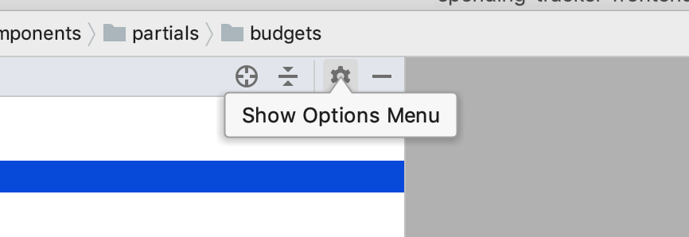
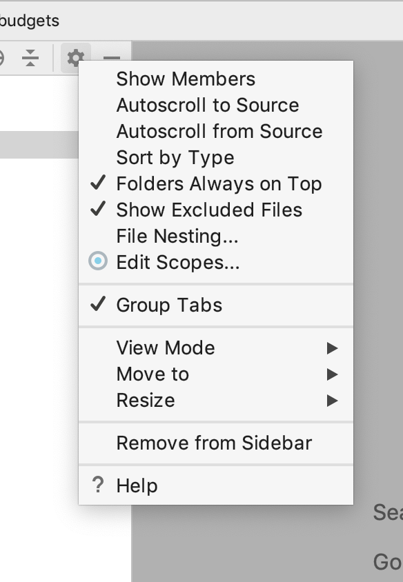
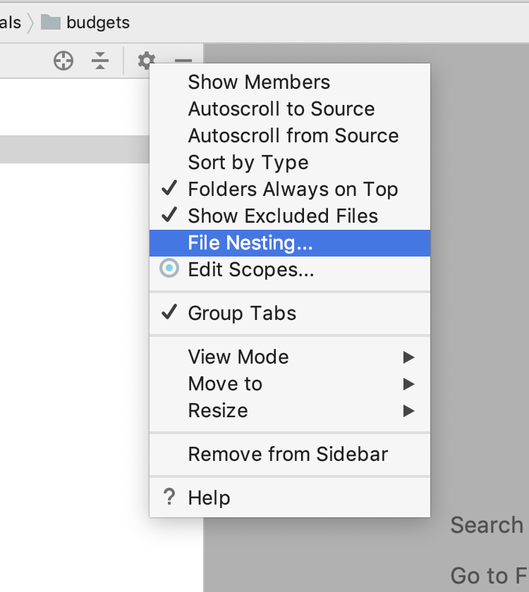
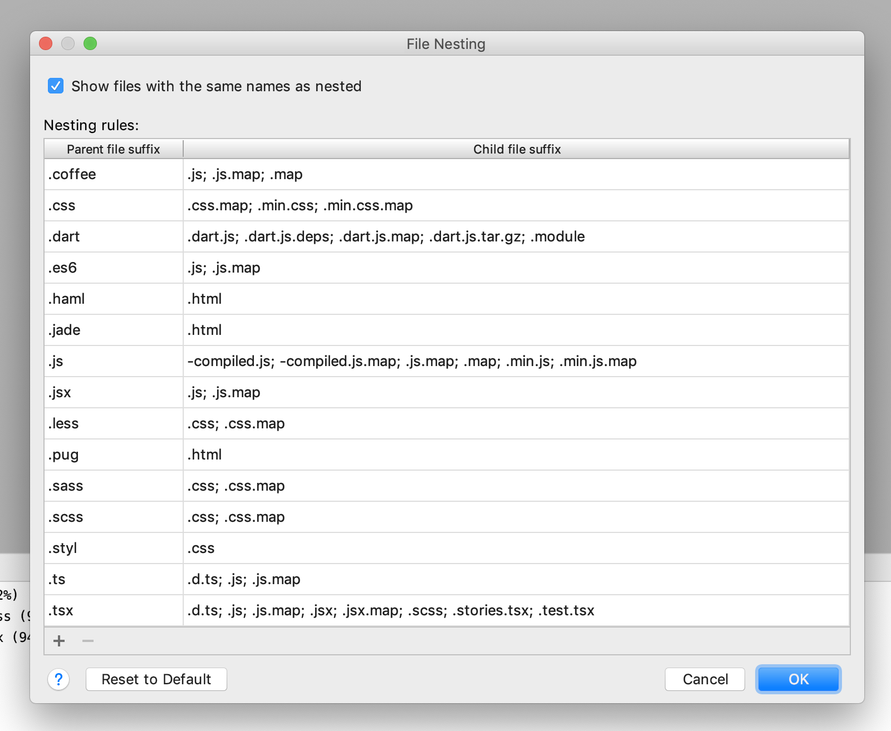

# Webstorm
- Command + Shift + N
  - Opens a dialog to search for a file in the project
- Control + Shift + F
  - Opens the Find in Path dialog

### File Nesting 
File nesting allows you to nest all of the files with matching names under one file, let's take for example these files:

```
Component.tsx
Component.scss
Component.test.tsx
Component.stories.tsx
```
We can group all of the files under a single file, the `Component.tsx`. Inside the project view at the top right of the panel is a settings cog:



Click that then you will see this menu:



Then select `File Nesting...`:



Down at the bottom you'll see the `.tsx`:



In that image you'll see the following line:

`.scss; .stories.tsx; .test.tsx`

This tells webstorm that we want to add any files that match that pattern underneath of the main `Component.tsx` which will end up looking something like this:


# PHPStorm
- Shift + Command + option + L
  - Reformats code per `code style` settings in the preferences